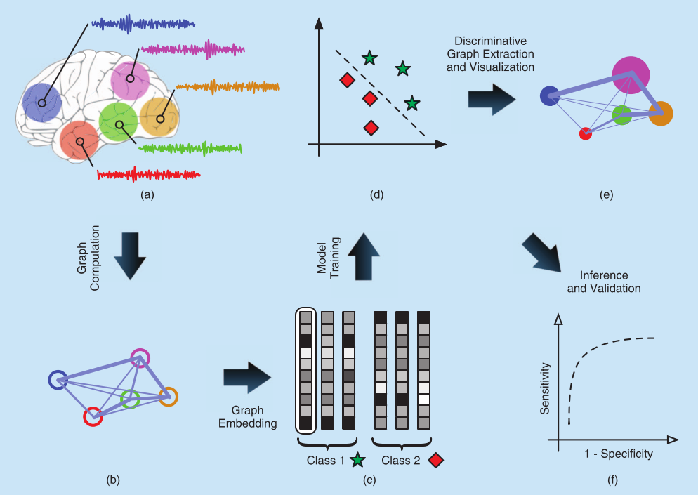

## MRes Project

#### Graph Theory as an Alzheimer's Disease Diagnostic Instrument in the Context of Functional Brain Connectivity

- Supervisor: Dr Javier Escudero - University of Edinburgh ([link](http://www.research.ed.ac.uk/portal/jescuder))
- Collaborators: Prof Alberto Fernández - Complutense University of Madrid ([link](https://www.ucm.es/psiquiatria/directorio?id=9190))

This repository also includes follow-up work on the MRes project. It was presented at the [BrainModes](http://www.brainmodes.org/) 2014 conference: [poster](./docs/BrainModes2014_poster.pdf) and [link](http://goo.gl/H39ueD) to contribution.

## Pipeline Overview

Image credit: Richiardi et al. (2013) [link](http://ieeexplore.ieee.org/xpl/login.jsp?tp=&arnumber=6494687)

## File structure

- docs - contains thesis, project proposal and posters
- processed_data - contains example connectivity matrices for a subject, computed graph features and statistics
- report - contains LaTeX code for report
- sources - contains source files

## List of programs (*sources* folder)

- mfiles
    - checkDataIntegrity.m - checks if recordings within "data/MEG_AD_Thesis/MEG_50863_noECG_10s" (folder with original data) contain any values other than double such as NUL or NaN, checks if the no of channels is the same for all epochs, checks if no of time samples is the same for all epochs
    - modifyHeader.m - modifies the 4D_header_original.mat file from so it matches the details of the MEG machine used for collecting our data. The header is needed for loading data in FieldTrip.
    - setUpGlobals.m - sets up global variables to be used by the analysis scripts
    - getConnectivityMatrices.m - gets connectivity matrices by processing all epochs for a subject using Welch's method
    - getFullGraphMeasures.m - loads connectivity matrices of chosen connectivity measure and computes graph measures (i.e. features)
    - getMSTGraphMeasures.m - loads connectivity matrices of chosen connectivity measure and computes graph measures on minimum spanning trees (MSTs)
    - parSaveConnectivityMatrix.m - utility function used to save matrices in parallel loop of getConnectivityMatrices.m
    - parSaveFullGraphMeasures.m - utility function used to save graph measures in parallel loop of getFullGraphMeasures.m
    - createFullGraphMeasuresDataset.m - loads computed graph features from individual files and compiles a dataset matrix from them
    - createMSTGraphMeasuresDataset.m - loads computed MST features from individual files and compiles a dataset matrix from them
    - utils
        - backbone_mst.m - computes MST
        - charpath_original.m - computes some graph measures from given distance matrix (this is the version of 2014_04_05_BCT, used in the MRes project)
        - csvwrite_with_headers.m - functions like the built-in MATLAB function *csvwrite*, but allows a row of headers to be easily inserted
        - getAllFilesInDirectory.m - gets all files (recursively) within a directory

- misc
    - 4D148.lay - layout file of MEG channels used for FielTrip plotting
    - 4D_header_adapted.mat - used to load data into FieldTrip
    - 4D_header_original.mat - original header of MEG data from [Ricardo](http://meg.ctb.upm.es/members/students/bruna/) (CTB Madrid)

- notebooks
    - project_notes.ipynb - contains notes made during the project
    - testing_connectivity.ipynb - some signal processing exploration (Hilbert transforms, filtering)
    - testing_padding.ipynb - explore if MEG data padding is needed
    - plot_full_graph_measures.ipynb - plots graph measures
    - plot_MST_measures.ipynb - plots MST measures
    - statistical_testing.ipynb - code for Functional Data Analysis
    - classification.ipynb - trains classifiers on graph measures

## Required Software

To run the M-files, you would need MATLAB with [FieldTrip](http://www.fieldtriptoolbox.org/) and [Brain Connectivity Toolbox](https://sites.google.com/site/bctnet/). For the Jupyter notebooks, you would need [scikit-learn](http://scikit-learn.org/), [NumPy](http://www.numpy.org/), [SciPy](https://www.scipy.org/) and [matplotlib](http://matplotlib.org/).
